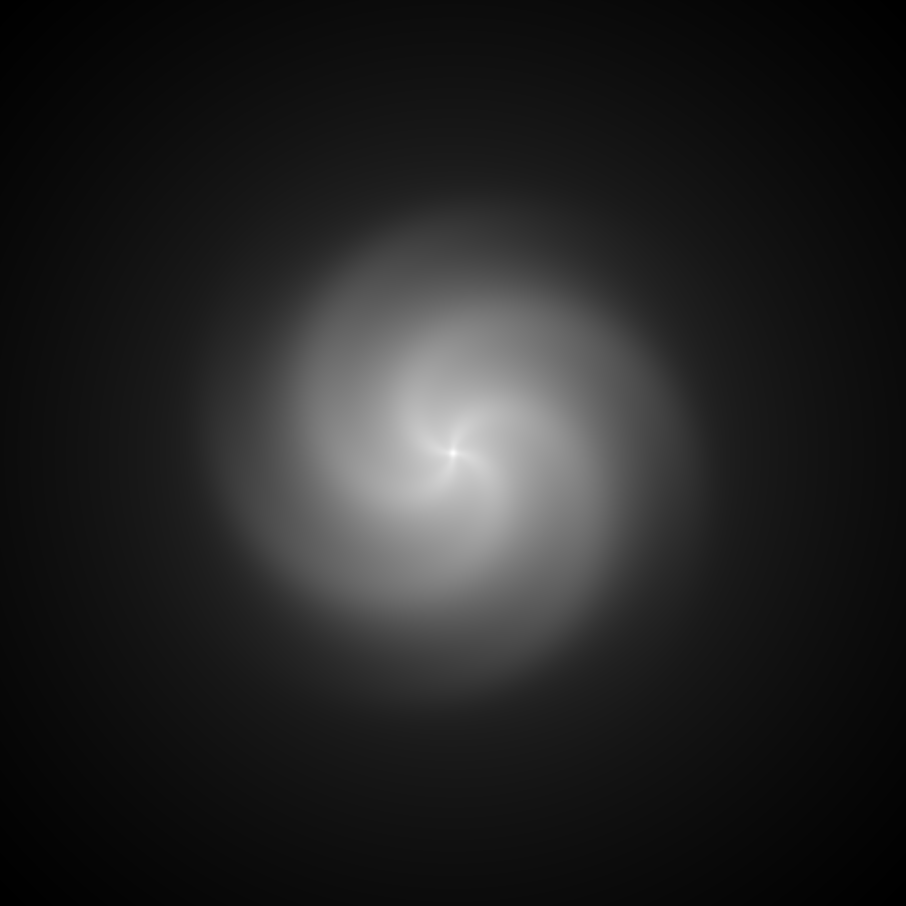

# Galaxy Gen

GPU-accelerated procedural galaxy generator. Renders spiral galaxies with
physically-inspired density models (exponential disk, Plummer bulge, power-law
halo, logarithmic spiral arms) and individual stars sampled from a Kroupa IMF
with blackbody colouring — all in real time on the GPU via a SPIR-V compute
shader.



## Prerequisites

- [Rust](https://rustup.rs) nightly-2026-04-11 (see `rust-toolchain.toml`)
- The `rust-src`, `rustc-dev`, and `llvm-tools` components (installed automatically by the toolchain file)
- A GPU with Vulkan 1.2 support

## Quick Start

```bash
# Build and run
cargo run --release
```

## Controls

| Key / Action        | Effect                     |
|---------------------|----------------------------|
| Left / Right arrow  | Decrease / increase exposure |
| Up / Down arrow     | Increase / decrease contrast |
| Mouse drag          | Pan                         |
| Mouse wheel         | Zoom in / out               |

## Development

```bash
cargo check        # Fast compile check
cargo clippy       # Lint
cargo test         # Run tests
cargo build        # Build
cargo run --release # Run optimized
```

## Architecture

- `src/main.rs` — window, input handling, rendering loop
- `src/gpu.rs` — GPU compute pipeline, uniform buffer, dispatch
- `src/galaxy.rs` — galaxy parameter definitions
- `src/display.wgsl` — fullscreen quad vertex/fragment shader
- `src/lib.rs` — crate root, re-exports
- `galaxy-shader/` — SPIR-V compute shader (density model, stars, tone mapping)
- `build.rs` — compiles galaxy-shader to SPIR-V via spirv-builder
